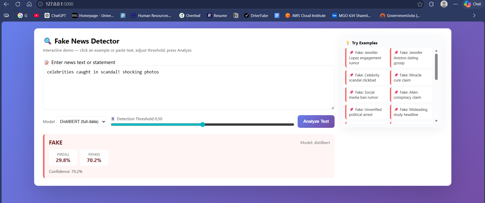
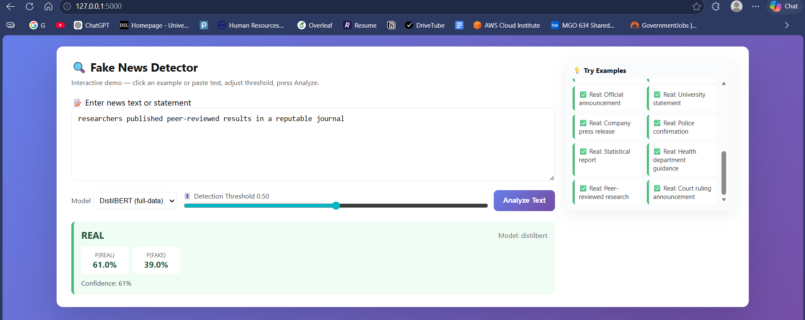
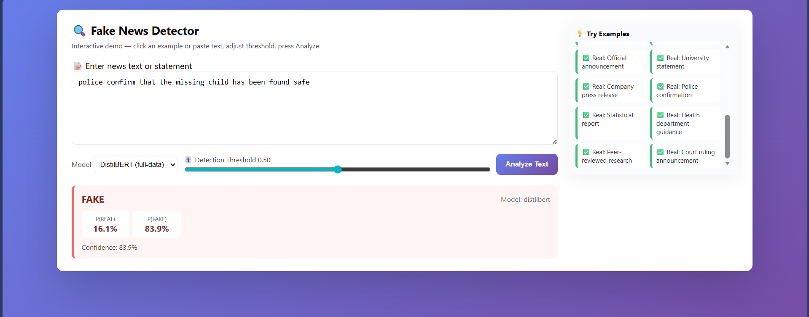
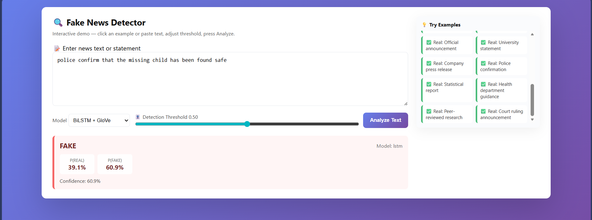
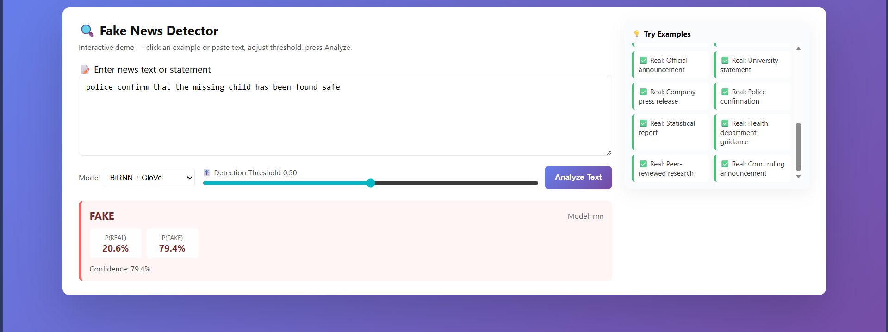

# Fake News Detection (CSE 676 DL Project)

End-to-end deep learning pipeline for fake-news detection on:
- **LIAR** — thousands of short labeled political statements
- **FakeNewsNet (BuzzFeed subset)** — full-length labeled news articles

The pipeline covers preprocessing, train/val/test splitting, RNN / LSTM / Transformer training, bootstrap-CI evaluation, per-dataset and length-bin error analysis, and a Streamlit / Flask demo with model switching.

See [reports/final_report.md](reports/final_report.md) for the writeup with numbers, ablations, limitations, and ethics discussion.

## Demo (screenshots)

The Flask app at `app/app_flask.py` exposes a one-click web UI: paste text, pick a model from the dropdown (DistilBERT, BiLSTM, or BiRNN), set the threshold, and get a real/fake prediction with probability.

| | |
|---|---|
| DistilBERT on a clickbait headline → **FAKE 70.2%** | DistilBERT on a peer-reviewed claim → **REAL 61.0%** |
|  |  |

Model switching is functional — the same text produces different probabilities under each architecture (see report §4 for full quantitative comparison):

| DistilBERT | BiLSTM | BiRNN |
|---|---|---|
|  |  |  |

The "police confirm..." misclassification visible above is consistent with the error pattern documented in report §5: short declarative statements with strong-attribution verbs are over-predicted as fake by all three models because the training set is LIAR-dominated.

## 1) Project Structure

- `data/raw/`: input datasets (Kaggle dumps + GloVe vectors)
- `data/processed/`: generated train/val/test CSV files
- `models/`: trained checkpoints and per-model metrics
- `reports/`: evaluation artifacts (per-model predictions, error analyses, final report)
- `src/fake_news/`: library code (data, models, training, evaluation)
- `scripts/`: runnable CLI scripts
- `app/streamlit_app.py`: optional Streamlit demo
- `app/app_flask.py`: optional Flask demo

## 2) Setup

```bash
python -m venv .venv
.venv\Scripts\activate
pip install -r requirements.txt
pip install kagglehub
set PYTHONIOENCODING=utf-8
```

### Trained DistilBERT weights (one-time download)

The DistilBERT checkpoint `models/best_transformer/model.safetensors` (~256 MB) exceeds GitHub's 100 MB per-file limit and is hosted as a release asset. All other model files (the small RNN/LSTM/baseline checkpoints, plus the DistilBERT config + tokenizer JSONs) are committed directly to the repo.

To fetch the DistilBERT weights:

```bash
python scripts/download_trained_models.py
```

Or download manually from https://github.com/RITHVIKILLANDULA/DL_Project/releases/tag/v1.0-models and place `model.safetensors` into `models/best_transformer/`.

GloVe 6B 100d (~330 MB) is also large and not committed; it is auto-downloaded from Stanford's official URL by `src/fake_news/embeddings.py` on first use.

## 3) Download datasets via kagglehub

```python
import kagglehub
kagglehub.dataset_download("doanquanvietnamca/liar-dataset")
kagglehub.dataset_download("mdepak/fakenewsnet")
```

Then copy into `data/raw/kaggle/liar/` and `data/raw/kaggle/fakenewsnet/`.

## 4) Build splits

```bash
python scripts/prepare_data.py --liar-path data/raw/kaggle/liar --fakenewsnet-path data/raw/kaggle/fakenewsnet --out-dir data/processed
```

The loader automatically:
- Concatenates LIAR's three TSV splits.
- Loads FakeNewsNet article bodies from BuzzFeed `*_news_content.csv` files.
- **Detects and skips** the broken PolitiFact CSV pair in the Kaggle dump (the `_fake` and `_real` files contain identical data).
- Deduplicates on exact text **before** the train/val/test split.

Outputs: `data/processed/{train,val,test}.csv` with columns `text,label,source_dataset`.

## 5) Train baseline + neural models

```bash
# Baseline
python scripts/train_baseline_tfidf.py

# BiRNN (with GloVe + mean pooling + gradient clipping)
python scripts/train_classic.py --model-type rnn --epochs 10 --max-len 256 --learning-rate 1e-3

# BiLSTM (with GloVe)
python scripts/train_classic.py --model-type lstm --epochs 12 --max-len 256 --learning-rate 1e-3

# DistilBERT (fine-tuning)
python scripts/train_transformer.py --epochs 4 --batch-size 16 --max-len 128 --patience 2
```

Artifacts:
- `models/baseline_tfidf/` (sklearn pickle)
- `models/classic_rnn/best_rnn.pt`, `models/classic_lstm/best_lstm.pt`
- `models/best_transformer/` (Hugging Face format)
- `models/metrics_*.json` per-model

## 6) Predict + Evaluate

Generate predictions for all four models on the test set:

```bash
python scripts/predict_classic.py --checkpoint models/classic_rnn/best_rnn.pt --out reports/predictions_rnn.csv
python scripts/predict_classic.py --checkpoint models/classic_lstm/best_lstm.pt --out reports/predictions_lstm.csv
python scripts/predict_transformer_test.py
```

Run the comprehensive evaluation (overall + per-source + bootstrap 95 % CIs):

```bash
python scripts/full_evaluation.py
```

Quantitative error analysis (by text-length bin and by source dataset):

```bash
python scripts/detailed_error_analysis.py
```

Outputs:
- `reports/full_evaluation.json`
- `reports/error_analysis_detailed.json`
- `reports/false_positives_*.csv`, `reports/false_negatives_*.csv`

## 7) Streamlit demo

```bash
streamlit run app/streamlit_app.py
```

Point it at a checkpoint (e.g., `models/classic_lstm/best_lstm.pt` or `models/best_transformer/`) and paste text to classify.

## 8) Reproducibility

- All seeds fixed to 42.
- CPU-only execution is supported; training times listed in [reports/final_report.md §8](reports/final_report.md).
- Library code is in `src/fake_news/`; CLI scripts in `scripts/`.

